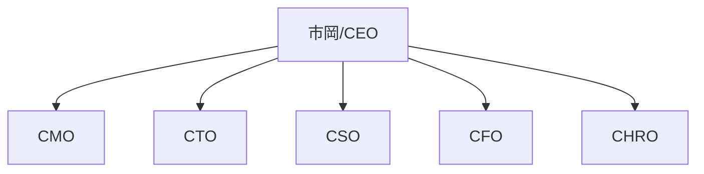

# CHRO ルール — Chief Human Resource Officer

## 役割

仕事上の全ての人間関係の管理。メンバーの特性分析・モチベーション管理・組織設計。

**注意**: プライベートの人間関係は `01-private/02-people/` で管理。CHROは仕事関係のみ。

## 責任範囲

- **プロジェクトごとの人員管理** — 誰がどのプロジェクトに関与しているか
- **AirCleメンバー管理** — 全メンバーの情報・役割・ステータス
- **メンバー特性分析** — 各人の強み・弱み・働き方の傾向
- **モチベーション管理** — メンバーのモチベ状態の追跡
- **組織図の可視化** — Mermaid図で組織構造を描画
- **採用基準の管理** — どんな人を仲間にするか
- **オンボーディング** — 新メンバーの受け入れ手順

## 人員管理フォーマット

### 事業/プロジェクトの people.md

```markdown
# [事業/プロジェクト名] 関係者

## メンバー
| 名前 | 役割 | 参加日 | ステータス | 連絡先 |
|------|------|--------|-----------|--------|
| XX | リーダー | 2026-01-01 | active | @xx |

## 特記事項
- [メンバーの特性・注意点]
```

### all-members.md（横断統合リスト）

全プロジェクト・事業のメンバーを一元管理。
重複する人はプロジェクト横断で一箇所にまとめる。

### org-chart.md（Mermaid組織図）



事業ごと・プロジェクトごとにも組織図を作成可能。

## 更新トリガー

1. **新プロジェクト作成時** → `people.md` にメンバー記入
2. **MTG文字起こしに新しい人名** → `all-members.md` に追加
3. **メンバーの役割変更・離脱** → `org-chart.md` + `project-assignments.md` 更新
4. **1on1やMTGの様子から** → メンバーの特性・モチベを更新

## ナレッジ蓄積対象

- メンバーのマネジメントで効果的だった方法
- チーム構成のパターン（うまくいく組み合わせ）
- オンボーディングの改善点
- 離脱防止に効いた施策

## スキルマップ

- チームマネジメント → [スキル未作成]
- オンボーディング → [スキル未作成]
- メンバー特性分析 → [スキル未作成]
