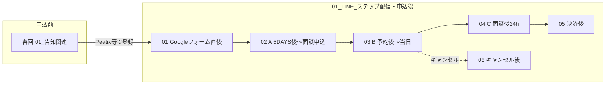

# 有料スクール（8週間）— `01_LINE_ステップ配信・申込後` の分類

正本は `02_有料スクール_8週間ワークショップ/01_LINE_ステップ配信・申込後/` 以下。番号は **ファネルの順**（申込前 → 無料5DAYS後 → 面談 → 決済 → 例外）。

---

## フォルダ対応表

| 番号 | フォルダ | 中身の意味 |
| --- | --- | --- |
| 00 | `00_セミナー申込前_リード獲得` | 無料5DAYS・各回の **申込前** コピーは各回の `01_告知関連`（README で案内） |
| 01 | `01_Googleフォーム回答直後_アーカイブ特典` | フォーム送信直後メッセージ（特典案内）＋**永久保存版note全員配布**のLINEステップ正本（`公式LINE_ステップ配信_永久保存版note_全員配布.md`） |
| 02 | `02_無料5DAYS終了後_審査面談申込まで` | **毎ローンチ作成**: 第N回フォルダに **開催中 Day3〜Day5**（有料詳細）＋ **A-1**（最終日直後）。**A-2〜A-6** は `00_全回共通` を正本とし都度微修正。索引は `Aシリーズ_インデックス.md` |
| 03 | `03_審査面談_予約後から当日まで` | **B-1〜B-6**（予約後リマインド〜面談直後） |
| 04 | `04_面談後_24時間意思決定` | **C-1〜C-3**（LP・24時間以内の意思決定） |
| 05 | `05_決済後_オンボーディング` | 決済確認後（Discord 等） |
| 06 | `06_審査面談_キャンセル後` | **D-1〜D-3**（面談キャンセル後の再予約） |
| 99 | `99_配信タイミングまとめ_全表.md` | A/B/C の表だけ（ルート直下ファイル） |

**無料セミナー開催中〜最終日のLINE** はセグメントが違う場合、各 **第N回** の `01_告知関連/公式LINE` などに置く（この `01_LINE_…` は主に **5DAYS後〜有料ワークショップ申込** 以降のステップ用）。

---

## フロー（Mermaid）

---

## `02_` 内の二層構造（有料ローンチ後のルール）

有料スクールを回すたびに、無料5DAYSの **Day3・Day4・Day5** でワークショップ詳細を説明する想定のとき、公式LINEのその回専用文案を **`第N回_（無料側と同名）/`** に置く。

- **`_テンプレ_新規回追加用/`** … 次の回を増やすときにフォルダごと複製。
- **`00_全回共通/`** … セミナー**終了後**の A-2〜A-6（追い配信）。毎回ゼロから書かない。

詳細は `02_無料5DAYS終了後_審査面談申込まで/README.md`。

---

## 運用メモ

- `{name}` や LIFF URL は配信ツールの変数・本番URLに差し替える。
- `99_` は一覧参照用。本文の正は各番号フォルダ内の Markdown。
