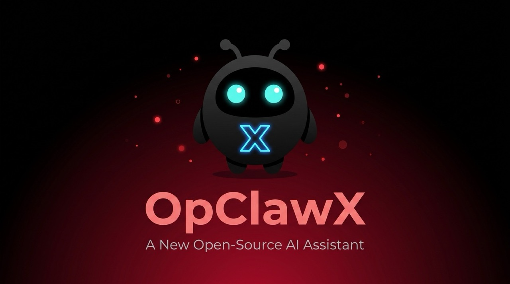

# OpClawX 🚀 — Your Knowledge, Automated

<p align="center">
  
</p>

<p align="center">
  <strong>Your Experience × AI = Viral Posts That Sound Like You</strong><br>
  <strong>あなたの経験 × AI = あなたらしいバズる投稿</strong><br>
  <strong>你的经验 × AI = 像你风格的爆款帖子</strong><br>
  <strong>당신의 경험 × AI = 당신다운 바이럴 게시물</strong>
</p>

<p align="center">
  <a href="https://opensource.org/licenses/MIT"></a>
  <a href="https://nodejs.org"></a>
  
  
  
</p>

<p align="center">
  <a href="#english">🇺🇸 English</a> •
  <a href="#japanese">🇯🇵 日本語</a> •
  <a href="#chinese">🇨🇳 中文</a> •
  <a href="#korean">🇰🇷 한국어</a> •
  <a href="#spanish">🇪🇸 Español</a>
</p>

---

## ✨ What Makes OpClawX Different

**Not templates. Not generic AI. It's YOU, amplified.**

OpClawX learns from your actual experiences, writing style, and expertise to create posts that sound authentically like you — not like AI wrote them.

```
┌────────────────────────────────────────────────────────────────┐
│  INPUT: Your World                                              │
│  ├── Your experiences (from OpenClaw memory)                  │
│  ├── Your writing style (tone, phrases, emojis)               │
│  ├── Your expertise topics                                    │
│  └── Your audience engagement patterns (optional X data)      │
├────────────────────────────────────────────────────────────────┤
│  PROCESS: AI with Context                                       │
│  ├── Analyzes your unique voice                                 │
│  ├── Incorporates real experiences                              │
│  ├── Generates 15 different post types                          │
│  └── Delivers 3x daily via URL                                  │
├────────────────────────────────────────────────────────────────┤
│  OUTPUT: Authentic Viral Posts                                  │
│  ├── Sounds like YOU wrote them                                 │
│  ├── Based on YOUR actual experiences                           │
│  └── Ready to post on X/Twitter/LinkedIn/etc.                   │
└────────────────────────────────────────────────────────────────┘
```

---

<a name="english"></a>
## 🇺🇸 English

### What You Get

**3 times daily** — Morning (7AM), Lunch (12PM), Evening (6PM)

Each delivery includes **15 viral post ideas** across different patterns:

| # | Pattern | Example Output |
|---|---------|----------------|
| 1 | **Breaking News** | Your take on industry news |
| 2 | **Save for Later** | Comprehensive guides your audience bookmarks |
| 3 | **Global Trend** | International trends with your analysis |
| 4 | **Conclusion First** | Your experience-based insights upfront |
| 5 | **Honest Opinion** | Real talk from your actual experience |
| 6 | **VS Battle** | Comparisons based on your testing |
| 7 | **First Impression** | Authentic reviews from your memory |
| 8 | **By The Numbers** | Data-driven analysis from your research |
| 9 | **Insight** | Deep insights only you can provide |
| 10 | **Free Resource** | Knowledge you've accumulated |
| 11 | **Pro Tips** | Tricks learned from practice |
| 12 | **Warning** | Lessons from your mistakes |
| 13 | **Storytelling** | Your growth journey |
| 14 | **Complete Guide** | Comprehensive knowledge from your expertise |
| 15 | **Future Forecast** | Predictions based on your knowledge |

### Quick Start

```bash
# Install
git clone https://github.com/ichiko5963/OpClawX.git
cd OpClawX
npm install

# Configure
cp .env.example .env
# Add your API keys

# Run once to test
node scheduler/daily-15.js --lang en --slot morning

# Set up 3x daily automation
crontab -e
0 7 * * * cd /path/to/OpClawX && node scheduler/daily-15.js --lang en --slot morning
0 12 * * * cd /path/to/OpClawX && node scheduler/daily-15.js --lang en --slot lunch
0 18 * * * cd /path/to/OpClawX && node scheduler/daily-15.js --lang en --slot evening
```

### Works For Any Industry

- **Developers** → Code tutorials, tool reviews, tech insights
- **Marketers** → Strategy tips, case studies, trend analysis
- **Designers** → Portfolio showcases, design tips, tool comparisons
- **Consultants** → Industry insights, client lessons, frameworks
- **Creators** → Content strategies, growth stories, monetization
- **Founders** → Startup journeys, fundraising, product launches

---

<a name="japanese"></a>
## 🇯🇵 日本語

### どんな人に向いている？

**全業種・全職種対応**

- **エンジニア** → 技術記事、ツールレビュー、開発Tips
- **マーケター** → 戦略解説、事例分析、トレンド考察
- **デザイナー** → ポートフォリオ、デザインTips、ツール比較
- **コンサルタント** → 業界洞察、顧客事例、フレームワーク
- **クリエイター** → コンテンツ戦略、成長ストーリー、収益化
- **経営者** → 起業体験、資金調達、プロダクト開発

### 1日3回の自動配信

```bash
# 朝7時 — 朝の投稿（業界ニュースの解説など）
0 7 * * * cd /path/to/OpClawX && node scheduler/daily-15.js --lang ja --slot morning

# 昼12時 — 昼の投稿（実践的なTipsなど）
0 12 * * * cd /path/to/OpClawX && node scheduler/daily-15.js --lang ja --slot lunch

# 夕方18時 — 夕方の投稿（振り返りや明日の予告など）
0 18 * * * cd /path/to/OpClawX && node scheduler/daily-15.js --lang ja --slot evening
```

---

<a name="chinese"></a>
## 🇨🇳 中文

### 适用人群

**全行业支持**

- **开发者** → 技术教程、工具评测、编程技巧
- **营销人员** → 策略分享、案例分析、趋势解读
- **设计师** → 作品展示、设计技巧、工具对比
- **顾问** → 行业洞察、客户案例、方法论
- **创作者** → 内容策略、成长故事、变现技巧
- **创业者** → 创业经历、融资经验、产品发布

### 每日3次自动发布

```bash
# 早上7点
0 7 * * * cd /path/to/OpClawX && node scheduler/daily-15.js --lang cn --slot morning

# 中午12点
0 12 * * * cd /path/to/OpClawX && node scheduler/daily-15.js --lang cn --slot lunch

# 晚上6点
0 18 * * * cd /path/to/OpClawX && node scheduler/daily-15.js --lang cn --slot evening
```

---

<a name="korean"></a>
## 🇰🇷 한국어

### 어떤 사람에게 좋을까요?

**모든 산업 지원**

- **개발자** → 기술 튜토리얼, 도구 리뷰, 개발 팁
- **마케터** → 전략 공유, 사례 분석, 트렌드 해석
- **디자이너** → 포트폴리오, 디자인 팁, 도구 비교
- **컨설턴트** → 산업 인사이트, 고객 사례, 프레임워크
- **크리에이터** → 콘텐츠 전략, 성장 스토리, 수익화
- **창업자** → 창업 경험, 투자 유치, 제품 출시

### 하루 3회 자동 발송

```bash
# 아침 7시
0 7 * * * cd /path/to/OpClawX && node scheduler/daily-15.js --lang ko --slot morning

# 점심 12시
0 12 * * * cd /path/to/OpClawX && node scheduler/daily-15.js --lang ko --slot lunch

# 저녁 6시
0 18 * * * cd /path/to/OpClawX && node scheduler/daily-15.js --lang ko --slot evening
```

---

<a name="spanish"></a>
## 🇪🇸 Español

### Para quién es?

**Todas las industrias**

- **Desarrolladores** → Tutoriales, reseñas de herramientas, tips
- **Marketeros** → Estrategias, casos de estudio, análisis de tendencias
- **Diseñadores** → Portafolio, tips de diseño, comparaciones
- **Consultores** → Insights de industria, casos de clientes, frameworks
- **Creadores** → Estrategias de contenido, historias de crecimiento
- **Fundadores** → Experiencias de startup, fundraising, lanzamientos

### 3 veces al día

```bash
# 7 AM
0 7 * * * cd /path/to/OpClawX && node scheduler/daily-15.js --lang es --slot morning

# 12 PM
0 12 * * * cd /path/to/OpClawX && node scheduler/daily-15.js --lang es --slot lunch

# 6 PM
0 18 * * * cd /path/to/OpClawX && node scheduler/daily-15.js --lang es --slot evening
```

---

## 🚀 How It Works

### 1. Memory Analysis

OpClawX reads your OpenClaw memory to understand:

```javascript
// What the system learns about you
const yourProfile = {
  writingStyle: {
    tone: ['casual', 'professional'],  // Your voice
    commonPhrases: ['personally', 'in my experience'],
    emojiUsage: ['✨', '👇'],
    sentenceLength: 'medium'
  },
  expertise: ['Marketing', 'SaaS', 'Growth'], // Your topics
  experiences: [
    'Grew a startup from 0 to 10k users',
    'Failed 3 product launches before finding PMF',
    // ... your real stories
  ]
};
```

### 2. AI Generation with Context

The AI receives your profile and generates posts that sound like you:

**Generic AI Output:**
```
Here are 5 tips for growth marketing:
1. Focus on SEO
2. Use social media
3. Build an email list
...
```

**OpClawX Output (with your memory):**
```
After 3 failed launches, here's what actually worked for us:

We were spending $10k/month on ads with zero ROI.
Then we tried this one thing...

(Thread 🧵)
```

*The second one uses YOUR actual experience.*

### 3. 15 Patterns, 3x Daily

Each time slot generates 15 different post types:

- **Morning (7AM)** → News reactions, quick insights
- **Lunch (12PM)** → Educational content, tips
- **Evening (6PM)** → Stories, reflections, predictions

---

## 🔧 Configuration

### Environment Variables

```env
# Required: AI API Key
ANTHROPIC_API_KEY=sk-ant-...
# or
OPENAI_API_KEY=sk-...

# Optional: OpenClaw Memory
OPENCLAW_WORKSPACE=/Users/yourname/Documents/OpenClaw-Workspace
VPA_USE_MEMORY=true

# Optional: X Premium Data
XPREMIUM_DATA_PATH=./data/x-premium-export.csv

# Optional: Notifications
VPA_WEBHOOK_URL=https://discord.com/api/webhooks/...
VPA_BASE_URL=https://your-domain.com
```

---

## 📊 Supported Languages

| Language | Code | Status |
|----------|------|--------|
| English | `en` | ✅ Full Support |
| Japanese | `ja` | ✅ Full Support |
| Chinese | `cn` | ✅ Full Support |
| Korean | `ko` | ✅ Full Support |
| Spanish | `es` | ✅ Full Support |

---

## 🛠️ Architecture

```
Input Layer
├── OpenClaw Memory (your experiences)
├── X Premium Data (optional)
└── Latest News (optional)

Analysis Layer
├── Memory Analyzer (extracts your style)
├── Experience Extractor (finds your stories)
└── Style Profiler (learns your voice)

Generation Layer
├── AI Generator (Claude/OpenAI)
├── Context Builder (your profile → AI prompt)
└── 15 Pattern Generator

Output Layer
├── JSON API
├── Web UI (/daily.html)
└── Webhook (Discord/Slack)
```

---

## 📄 License

MIT — free for personal and commercial use.

---

<p align="center">
  Made with ❤️ for creators worldwide
</p>
