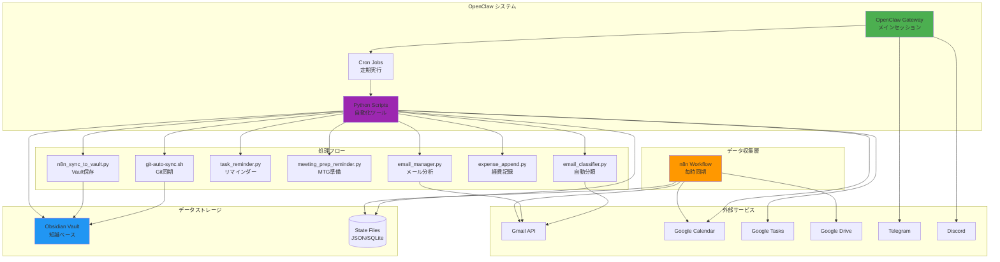
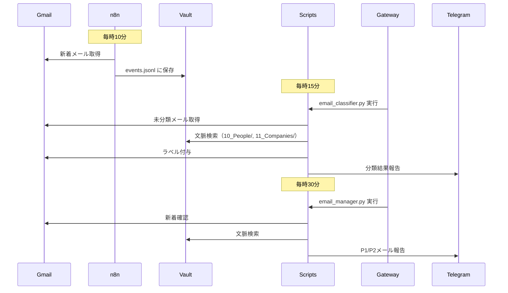
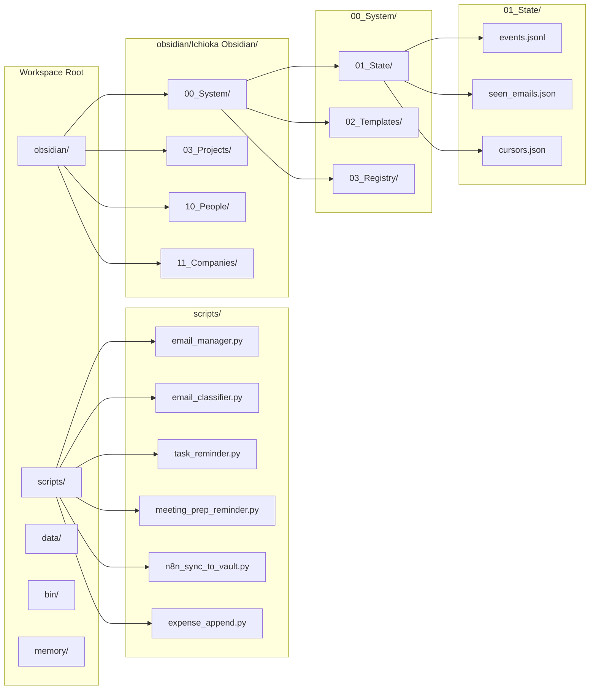
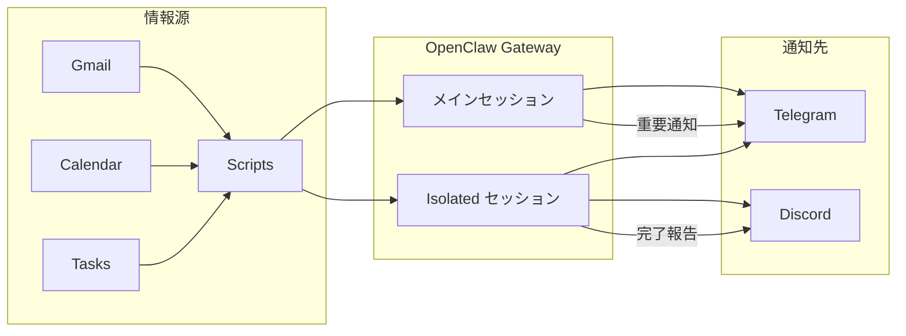
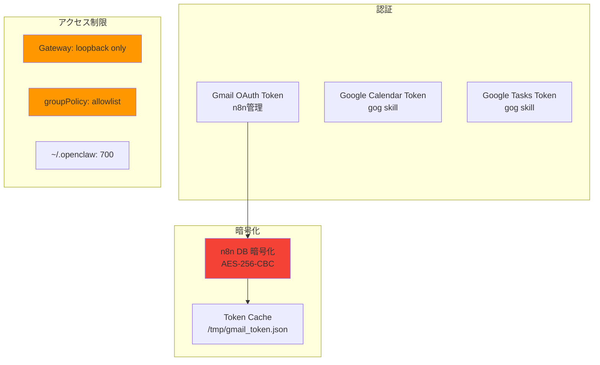

# システム全体アーキテクチャ

## 全体構成図



## データフロー詳細



## Cron スケジュール

```mermaid
gantt
    title 定期実行スケジュール
    dateFormat HH:mm
    axisFormat %H:%M
    
    section 毎時
    n8n Vault保存        :10:00, 1h
    メール分析            :15:00, 1h
    メール自動分類        :15:00, 1h
    メールチェック        :30:00, 1h
    BACKLOG確認          :30:00, 1h
    MTG準備リマインダー   :00:00, 30m
    Git自動同期          :14:00, 1h
    
    section 1日4回
    タスクリマインダー    :09:00, 12h
    タスクリマインダー    :12:00, 12h
    タスクリマインダー    :18:00, 12h
    タスクリマインダー    :21:00, 12h
    
    section 毎日1回
    深夜開発セッション    :01:00, 5h
    メモリ自動整理        :04:10, 3h
    X投稿作成            :06:00, 1h
    朝のブリーフィング    :07:00, 1h
    効率化提案           :12:00, 1h
    期限超えタスク通知    :15:00, 8h
    Daily Digest         :23:00, 1h
    経費スキャン         :23:00, 1h
```

## ファイル構成



## 主要スクリプト機能

| スクリプト | 実行頻度 | 機能 | 依存サービス |
|-----------|---------|------|-------------|
| `email_manager.py` | 毎時30分 | 新着メール分析・優先度判定・返信案生成 | Gmail API, Vault |
| `email_classifier.py` | 毎時15分 | メール自動ラベル付与（最大30件） | Gmail API, Vault |
| `n8n_sync_to_vault.py` | 毎時10分 | n8nイベントをVaultに保存 | n8n DB |
| `task_reminder.py` | 9/12/18/21時 | タスク期限リマインダー（3日前/1日前/12時間前） | Google Tasks |
| `meeting_prep_reminder.py` | 毎30分 | 2時間以内のMTG準備リスト送信 | Google Calendar |
| `expense_append.py` | 毎日23時 | 領収書スキャン→スプレッドシート追記 | Gmail, Google Sheets |
| `daily_digest.py` | 毎日23時 | Executive Summary生成 | Vault |
| `memory_organizer.py` | 毎日4:10 | メモリ自動整理（曜日別テーマ） | Vault |
| `git-auto-sync.sh` | 毎時 | Git自動同期（push/pull） | GitHub |

## 通知フロー



## セキュリティ層



---

## 更新履歴

- 2026-02-16: 初版作成（タイムアウト機能追加後）
